# Agent-First SaaS UI Pattern Reference

## Purpose

This is a coding-agent-facing companion to `docs/ai-first-saas-coding-agent-framework.md`.

Use this document when generating UI specifications, component hierarchies, screen layouts, interaction flows, or visual acceptance criteria for an ai-first SaaS application.

The images in `docs/images/` are not canonical designs. Treat them as pattern references. Extract useful structural ideas, but continue to obey the object model, substrate requirements, policy model, audit model, and screen archetypes defined in the main framework document.

---

## 1. How coding agents should use these images

When using a sample image, do not copy it blindly. For each screen, identify:

1. Which ai-first surface it represents.
2. Which human role it supports.
3. Which temporal mode it serves.
4. Which durable objects it implies.
5. Which policy, decision, trace, or audit data must exist behind the UI.
6. Which elements are only visual decoration and should not drive the data model.

Every UI generated from these samples must still expose structured objects such as:

- `Goal`
- `ExecutionPlan`
- `Agent`
- `DecisionCard`
- `PolicyDocument`
- `PolicyClause`
- `AuditEvent`
- `WorkTrace`
- `EvidenceItem`
- `OutcomeMetric`

---

## 2. Image inventory and primary mapping

| Image                        | Primary surface                         | Secondary patterns                                                          |
| ---------------------------- | --------------------------------------- | --------------------------------------------------------------------------- |
| `agent-app-ui-example-1.png` | Command Center / Mission Control        | Objective banner, approval queue, agent roster, activity stream             |
| `agent-app-ui-example-2.png` | Command Center / Operations Dashboard   | Metrics strip, task queue, risk/status panels, agent activity               |
| `agent-app-ui-example-3.png` | Goal / Account Command Center           | Objective tracking, customer/account context, execution timeline            |
| `agent-app-ui-example-4.png` | Fleet / Operations Mission Control      | Multi-agent monitoring, operational telemetry, risk map                     |
| `agent-app-ui-example-5.png` | Policy / Governance / Simulation Center | Policy testing, replay, threshold tuning, policy health                     |
| `agent-app-ui-example-6.png` | Approvals & Exceptions Center           | Decision queue, recommendation panel, impact/risk summary                   |
| `saas-ai-1.png`              | Compact Command Center                  | Goal progress, agent activity, approval queue, agent roster                 |
| `saas-ai-2.png`              | Decision Card / Deviation Review        | Policy deviation, recommendation, evidence, alternatives, approval controls |
| `saas-ai-3.png`              | Policy / Intent Editor                  | Clause editing, examples, preview impact, commit controls                   |
| `saas-ai-4.png`              | Async Digest / Executive Briefing       | Catch-up summary, curated stories, pending decisions                        |
| `saas-ai-5.png`              | Goal-to-Execution Workbench             | Intent-to-plan, agent assignment, execution plan approval                   |
| `saas-ai-6.png`              | Account / Objective Briefing            | Objective progress, recent activity, open items                             |
| `saas-ai-7.png`              | Audit / Work Trace                      | Decision provenance, policy trace, evidence, timeline                       |
| `saas-ai-8.png`              | Service Incident Timeline               | Exception trace, multi-agent handoff, audit timeline                        |

---

## 3. Surface pattern: Command Center / Mission Control

Relevant images:

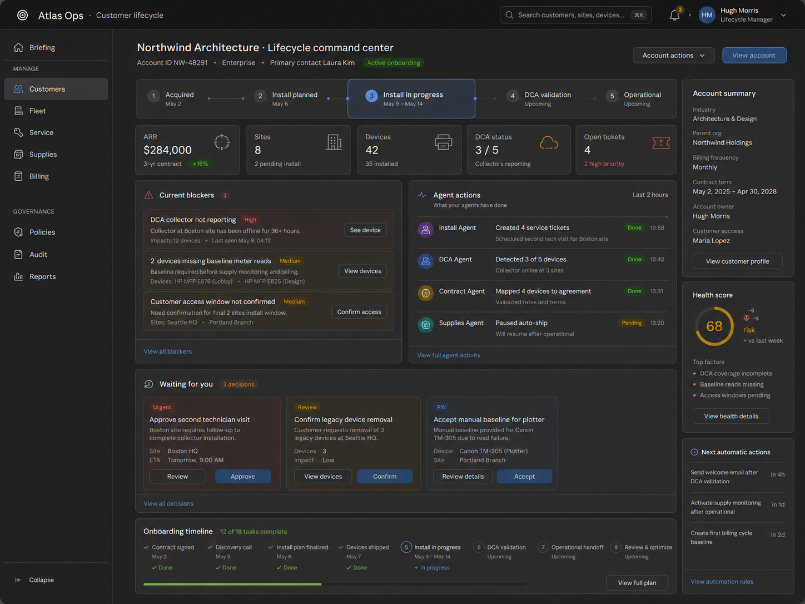

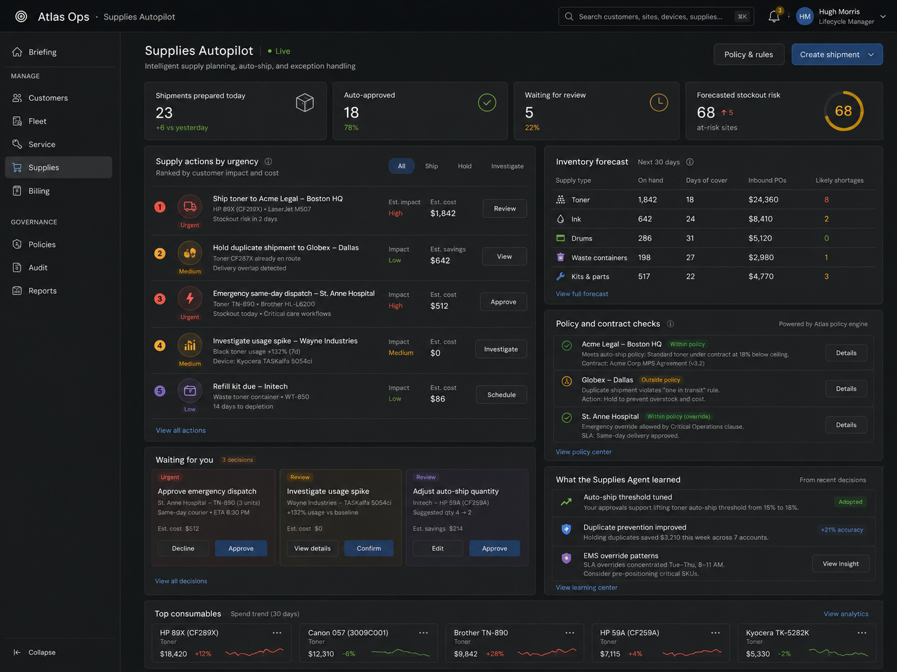

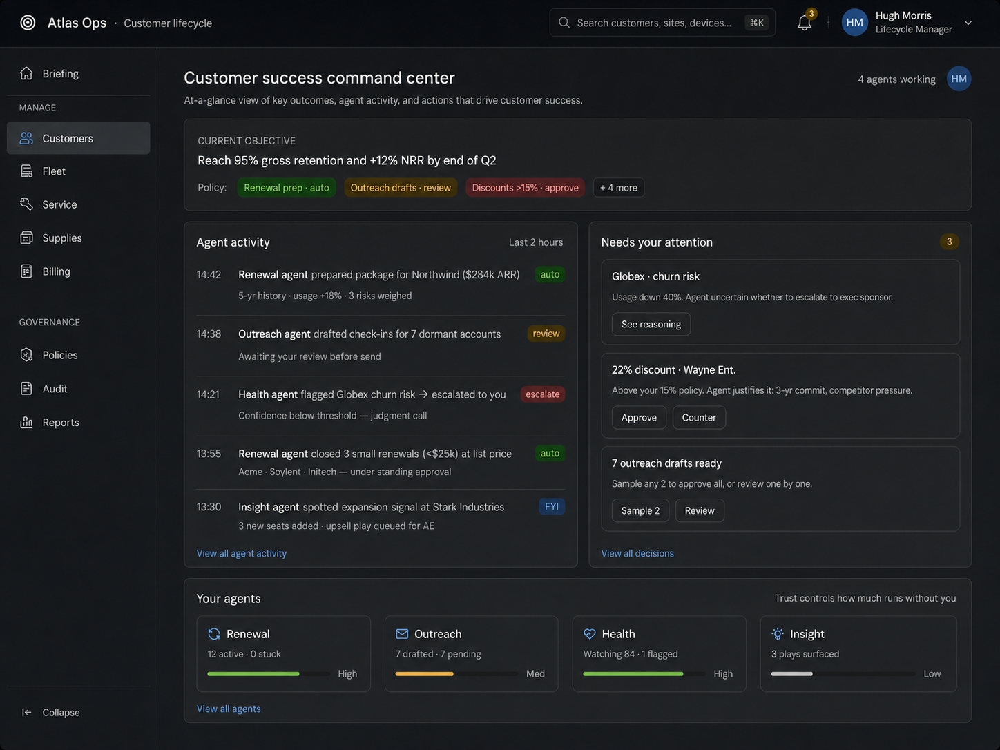

### Use when

The user is supervising current autonomous work.

Temporal mode:

- `attending_now`

Human roles:

- Supervisor
- Reviewer
- Outcome Owner
- Auditor

### Required layout primitives

A Command Center should generally include:

- objective or account banner;
- key outcome metrics;
- policy/autonomy status chips;
- agent activity stream;
- approval or exception queue;
- agent roster;
- risk/status summary;
- compressed routine activity summary;
- drill-down links into traces, decisions, and records.

### Required backing objects

- `Goal`
- `Objective`
- `Agent`
- `ExecutionPlan`
- `Task`
- `ActivityEvent`
- `ApprovalRequest`
- `Exception`
- `OutcomeMetric`
- `PolicyInvocation`
- `WorkTrace`

### Implementation guidance

Copy these ideas:

- high-level objective at the top;
- visible distinction between automated work and human-needed work;
- agent roster/status area;
- activity stream as the primary scan target;
- compact metrics that summarize progress and risk;
- right-side or secondary panel for pending approvals/exceptions.

Avoid these mistakes:

- do not make the screen only a KPI dashboard;
- do not hide policy boundaries in settings;
- do not show raw event noise without curation;
- do not make records/modules the main navigation axis;
- do not show agent status without linking to agent authority and traces.

### Acceptance criteria

A generated Command Center is valid only if:

- every visible activity item links to a trace or source artifact;
- every approval item has evidence, risk, confidence, and policy trigger data available;
- routine activity is compressed but auditable;
- agent actions have disposition tags such as `auto`, `review`, `approval`, `escalate`, or `fyi`;
- the user can determine what requires attention within a few seconds.

---

## 4. Surface pattern: Goal-to-Execution Workbench

Relevant image:

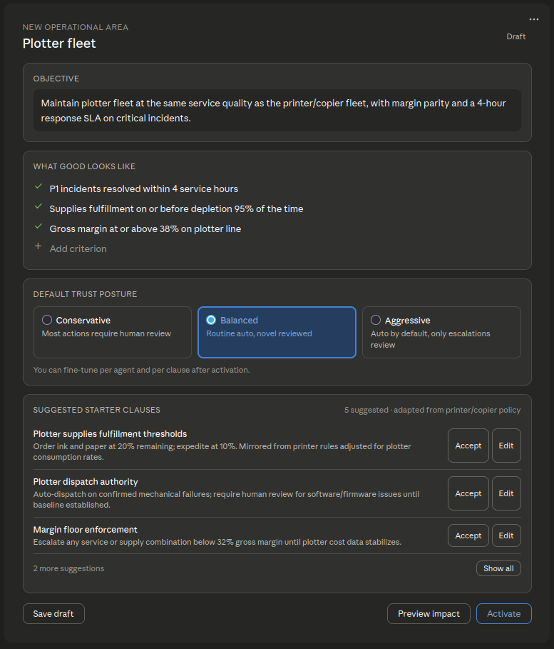

### Use when

The user has expressed an intent and the system must convert it into an executable plan.

Temporal mode:

- `delegating_now`

Human roles:

- Intent Author
- Supervisor
- Policy Owner

### Required layout primitives

- user intent / goal statement;
- generated plan summary;
- success criteria;
- proposed agent assignments;
- required tools and data;
- risk/confidence assessment;
- approval gates;
- timeline or phases;
- controls to approve, edit, simulate, or cancel.

### Required backing objects

- `Goal`
- `Objective`
- `SuccessCriterion`
- `ExecutionPlan`
- `AgentAssignment`
- `ToolRequirement`
- `DataRequirement`
- `ApprovalGate`
- `RiskAssessment`
- `SimulationResult`

### Implementation guidance

Copy these ideas:

- convert natural-language intent into structured plan sections;
- make agent assignments visible before execution;
- expose approval gates before activation;
- provide an explicit launch/approve control.

Avoid these mistakes:

- do not let chat commands execute high-impact plans without preview;
- do not create hidden tasks without a visible plan object;
- do not omit required data/tool permissions;
- do not activate a plan without recording policy version and audit event.

### Acceptance criteria

A generated Goal-to-Execution Workbench is valid only if:

- the goal is persisted as a durable object;
- the plan can be edited before activation;
- required permissions are visible;
- approval gates are visible;
- activation creates an audit event;
- the plan is bound to a policy version.

---

## 5. Surface pattern: Decision Card / Deviation Review

Relevant images:

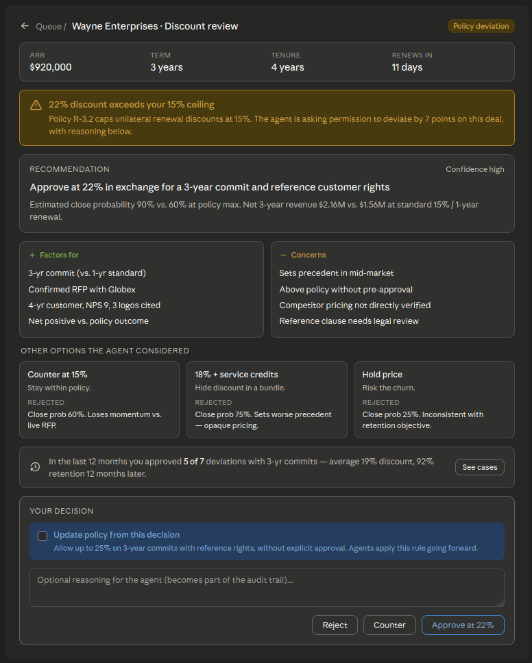

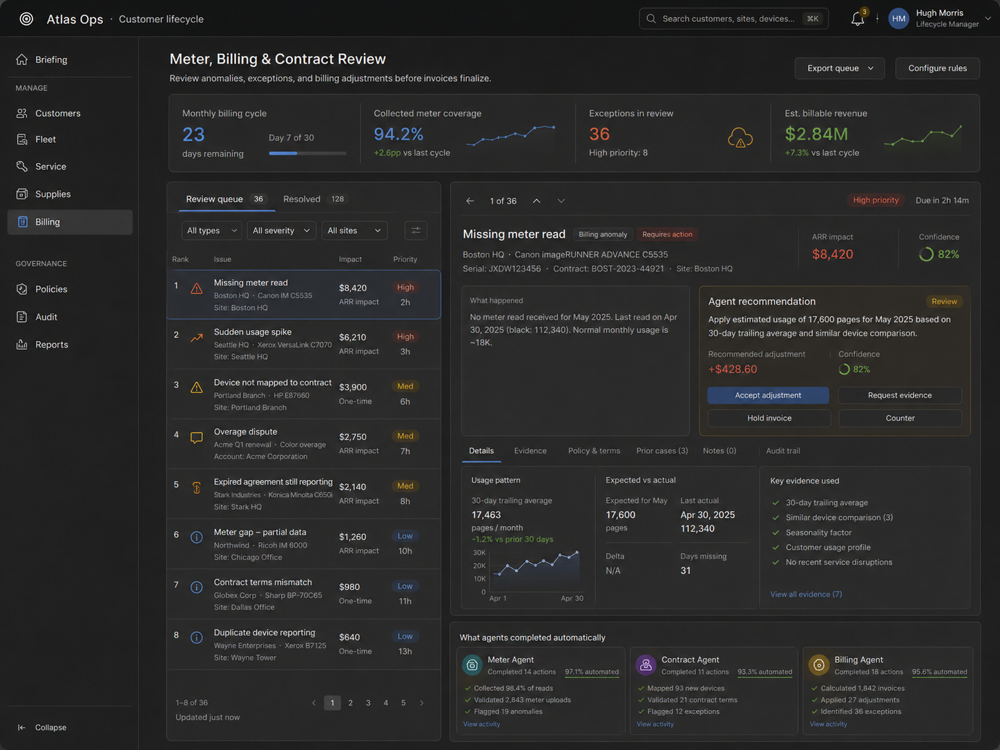

### Use when

An agent recommendation or action requires human judgment because of risk, uncertainty, policy deviation, impact, or authority boundary.

Temporal mode:

- `deciding_now`

Human roles:

- Reviewer / Approver
- Exception Handler
- Policy Owner / Coach
- Auditor

### Required layout primitives

- decision title;
- deviation or exception statement;
- agent recommendation;
- confidence/risk/impact indicators;
- policy trigger with stable clause ID;
- evidence list;
- reasoning factors for/against;
- alternatives considered;
- similar precedents;
- approve/reject/counter/request-evidence controls;
- learning option: one-time, precedent, example, or policy update.

### Required backing objects

- `DecisionCard`
- `Recommendation`
- `ApprovalRequest`
- `Exception`
- `PolicyClause`
- `EvidenceItem`
- `AlternativeConsidered`
- `ReasoningFactor`
- `Precedent`
- `HumanFeedback`
- `AuditEvent`

### Implementation guidance

Copy these ideas:

- focused decision surface rather than generic ticket detail;
- policy deviation highlighted near the top;
- recommendation and evidence shown together;
- alternatives considered shown explicitly;
- approval controls grouped with learning/teaching options.

Avoid these mistakes:

- do not provide approve/reject buttons without evidence;
- do not omit the policy clause that caused escalation;
- do not hide alternatives considered;
- do not rely on a chat panel as the main decision UI;
- do not let decisions disappear without outcome tracking.

### Acceptance criteria

A generated Decision Card is valid only if:

- it cites a stable policy clause ID;
- it includes recommendation, evidence, risk, confidence, and impact;
- it stores alternatives considered;
- it can create an audit event;
- it can optionally create a precedent, example, or policy proposal;
- it links to the underlying trace.

---

## 6. Surface pattern: Policy / Governance / Simulation Center

Relevant images:

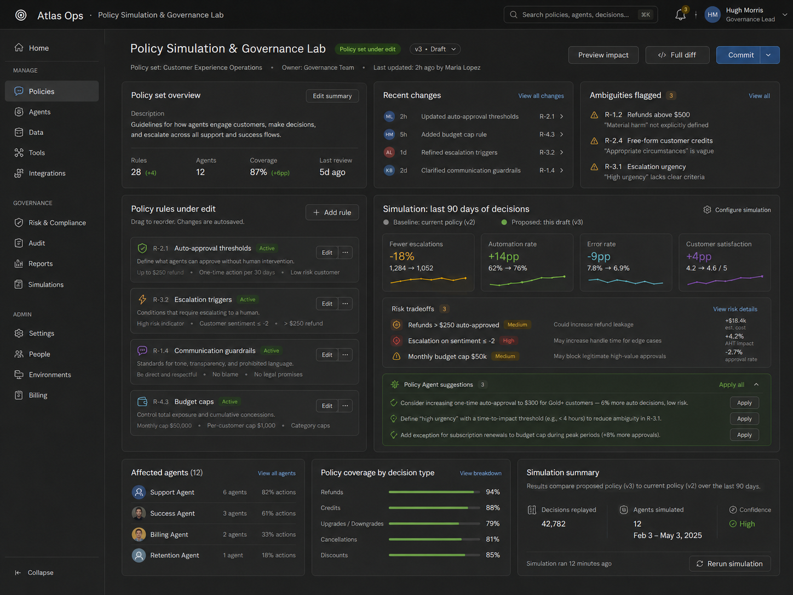

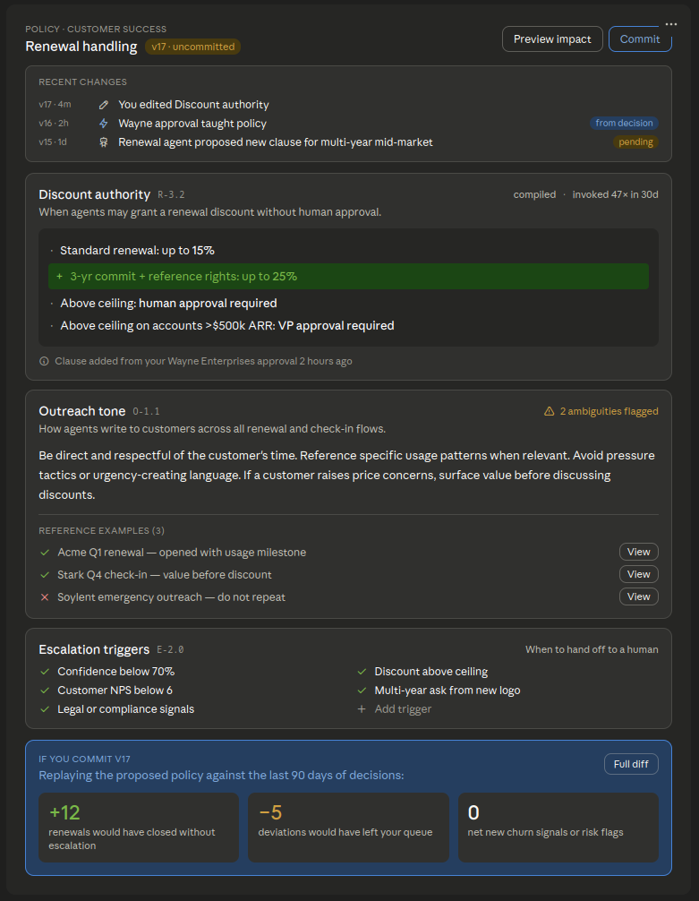

### Use when

The user is defining, revising, testing, or approving the rules that constrain agent behavior.

Temporal mode:

- `teaching_now`

Human roles:

- Policy Owner / Coach
- Intent Author
- Auditor
- Outcome Owner

### Required layout primitives

- versioned policy document;
- stable clause IDs;
- editable clauses;
- positive and negative examples;
- ambiguity/static-analysis warnings;
- agent-proposed changes;
- policy diff;
- replay/simulation results;
- impact preview;
- commit/discard controls.

### Required backing objects

- `PolicyDocument`
- `PolicyVersion`
- `PolicyClause`
- `PolicyCommit`
- `PolicyProposal`
- `ReferenceExample`
- `Guardrail`
- `ReplayResult`
- `SimulationResult`
- `PolicyInvocation`

### Implementation guidance

Copy these ideas:

- policy is an authoring surface, not a settings page;
- replay/simulation is visible before commit;
- policy health or ambiguity indicators are useful;
- proposed rule changes should be reviewable before activation.

Avoid these mistakes:

- do not treat policy as unversioned preferences;
- do not hide clause IDs;
- do not commit agent-proposed policy without human authorization;
- do not omit negative examples;
- do not change automation thresholds without previewing impact.

### Acceptance criteria

A generated Policy Center is valid only if:

- every policy change creates a commit;
- every clause has a stable ID;
- every agent execution can bind to a policy version;
- policy proposals preserve provenance;
- replay/simulation exists for high-impact changes;
- teach-from-decision changes are represented in the same commit model as direct edits.

---

## 7. Surface pattern: Async Digest / Executive Briefing

Relevant image:

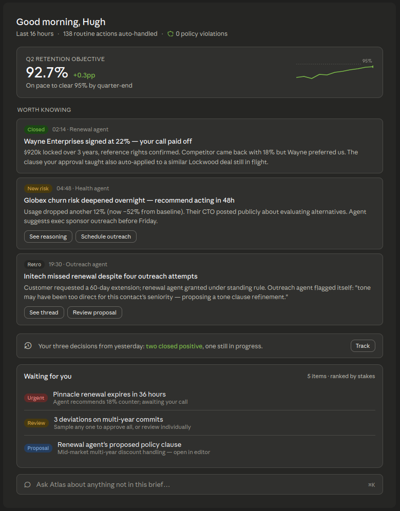

### Use when

The user returns after time away and needs a compressed summary of autonomous work.

Temporal mode:

- `catching_up`

Human roles:

- Supervisor
- Reviewer
- Outcome Owner
- Auditor

### Required layout primitives

- time window;
- routine activity compression statistic;
- policy violation count;
- outcome-shaped headline;
- curated stories;
- prior decision outcomes;
- pending decisions ranked by stakes;
- conversational follow-up input;
- link to full trace or activity history.

### Required backing objects

- `Digest`
- `ActivityEvent`
- `MaterialEvent`
- `OutcomeMetric`
- `DecisionOutcome`
- `ApprovalRequest`
- `CurationExplanation`
- `WorkTrace`

### Implementation guidance

Copy these ideas:

- concise briefing rather than dashboard grid;
- time-bounded summary;
- explicit automated-action count;
- a small number of curated stories;
- waiting queue below the summary.

Avoid these mistakes:

- do not list every event individually;
- do not hide how much activity was compressed;
- do not rank pending decisions only by recency;
- do not omit outcomes from prior human decisions.

### Acceptance criteria

A generated Async Digest is valid only if:

- it declares the time window;
- it states how much routine work was compressed;
- it surfaces material events;
- it includes pending decisions ranked by stakes;
- it links to underlying traces;
- it includes outcome feedback when available.

---

## 8. Surface pattern: Account / Objective Briefing

Relevant images:

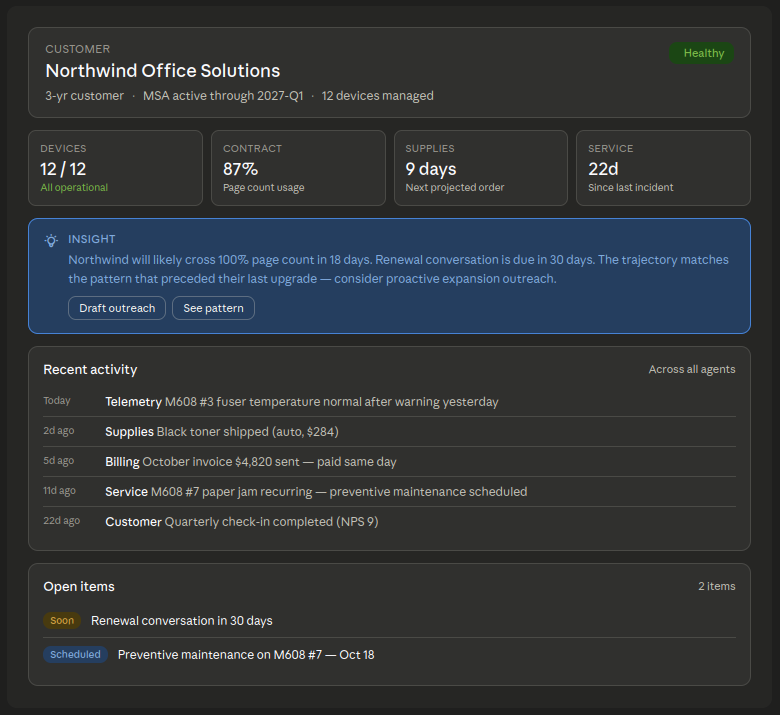

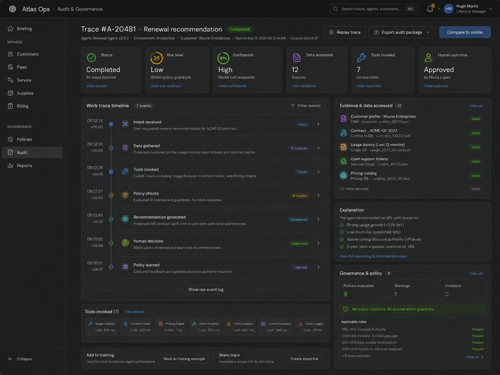

### Use when

The user needs a focused view of one customer, account, case, project, or objective while still seeing agent activity and open decisions.

Temporal mode:

- usually `attending_now`;
- sometimes `catching_up`.

Human roles:

- Supervisor
- Reviewer
- Outcome Owner
- Auditor

### Required layout primitives

- account/objective header;
- progress against goal;
- health/risk score;
- recent agent activity;
- open decisions;
- upcoming agent actions;
- relevant policy constraints;
- outcome history.

### Required backing objects

- domain entity, e.g. `Account`, `Customer`, `Case`, `Project`;
- `Goal`
- `Objective`
- `AgentActivity`
- `DecisionCard`
- `OutcomeMetric`
- `WorkTrace`

### Implementation guidance

Copy these ideas:

- combine domain context with agent work context;
- make recent activity and open decisions visible;
- show objective progress, not just record fields.

Avoid these mistakes:

- do not regress into a traditional CRM/account detail page;
- do not hide agent-generated context below raw fields;
- do not omit audit links for recent actions.

### Acceptance criteria

A generated Account / Objective Briefing is valid only if:

- it centers on an objective or outcome, not only a record;
- it shows agent activity related to that objective;
- it exposes pending decisions;
- it links to traces and policy invocations;
- it preserves access to domain data through drill-down.

---

## 9. Surface pattern: Fleet / Operations Mission Control

Relevant image:

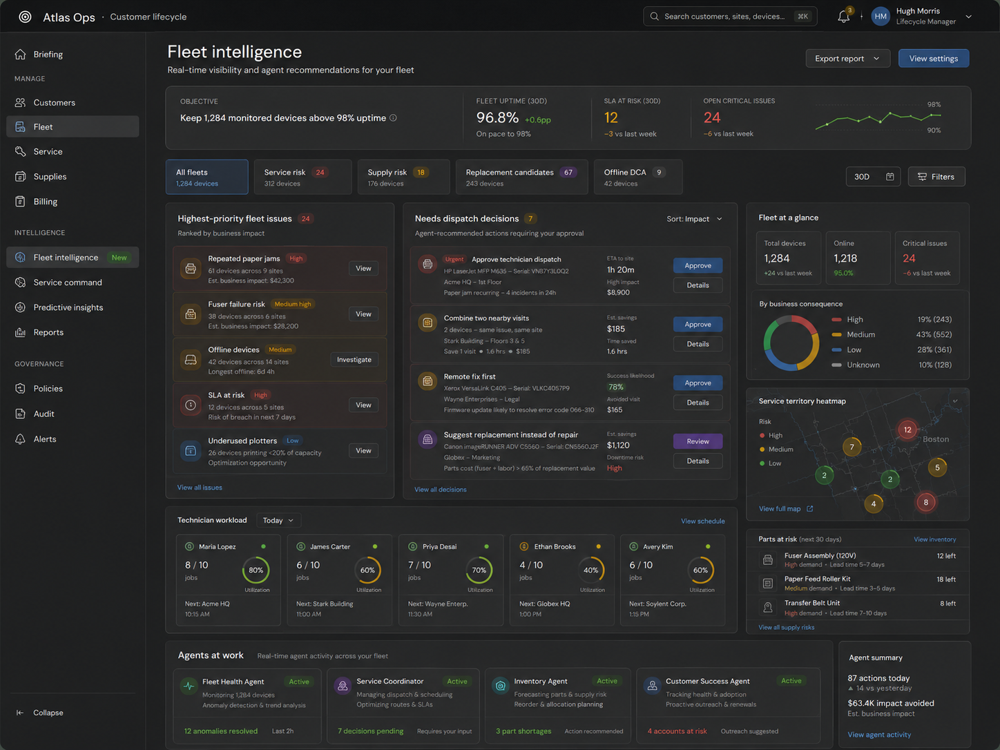

### Use when

The product manages many operational assets, cases, devices, jobs, tickets, or workflows at once.

Temporal mode:

- `attending_now`

Human roles:

- Supervisor
- Exception Handler
- Outcome Owner
- Auditor

### Required layout primitives

- operational scope selector;
- aggregate metrics;
- risk segmentation;
- agent activity across entities;
- exception clusters;
- geographic/network/fleet visualization if domain-relevant;
- pending interventions;
- automation health.

### Required backing objects

- domain asset/entity;
- `Agent`
- `Task`
- `Exception`
- `RiskScore`
- `OutcomeMetric`
- `ActivityEvent`
- `WorkTrace`

### Implementation guidance

Copy these ideas:

- show the operating system as a fleet of work, not one record at a time;
- combine telemetry with agent recommendations;
- rank operational issues by risk/impact.

Avoid these mistakes:

- do not create a static analytics dashboard with no decision affordances;
- do not show map/charts without linking to actions and traces;
- do not prioritize visual density over attention allocation.

### Acceptance criteria

A generated Fleet / Operations view is valid only if:

- risk and exception clusters can be drilled into;
- agent actions are visible and traceable;
- pending interventions are clearly separated from routine telemetry;
- high-stakes items are ranked above low-stakes noise.

---

## 10. Surface pattern: Audit / Work Trace

Relevant images:

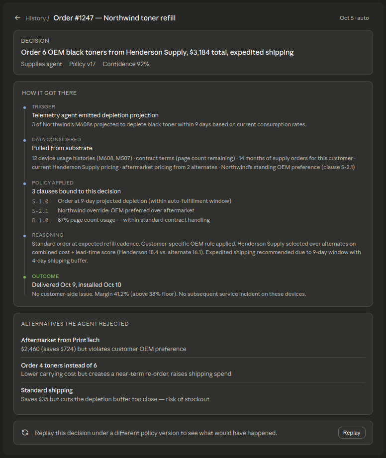

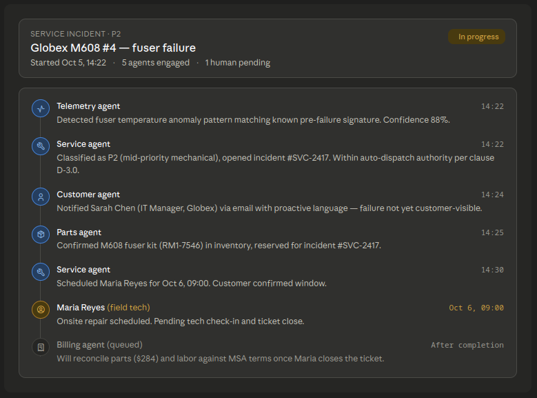

### Use when

The user asks why something happened, how an agent reached a decision, who approved it, or whether the action was authorized.

Temporal mode:

- `auditing_later`

Human roles:

- Auditor
- Exception Handler
- Policy Owner
- Reviewer

### Required layout primitives

- chronological trace;
- agent steps;
- tool calls;
- data access;
- evidence considered;
- policy clauses invoked;
- recommendations produced;
- human approvals or overrides;
- final action;
- outcome;
- rollback/reversibility status.

### Required backing objects

- `WorkTrace`
- `DecisionTrace`
- `AuditEvent`
- `ToolInvocation`
- `DataAccessEvent`
- `EvidenceItem`
- `PolicyInvocation`
- `HumanDecision`
- `OutcomeLink`
- `RollbackRecord`

### Implementation guidance

Copy these ideas:

- event timeline is a strong audit primitive;
- multi-agent handoffs should be explicit;
- policy and evidence should be visible in-line with the trace;
- current status should be obvious at the top.

Avoid these mistakes:

- do not expose raw logs as the only audit UI;
- do not omit policy version and clause IDs;
- do not hide data/tool access;
- do not show final outcome without the causal path.

### Acceptance criteria

A generated Audit / Work Trace is valid only if:

- it answers who/what/when/why/how-authorized;
- it includes policy version and clause references;
- it includes tool and data access events;
- it links decisions to outcomes;
- it indicates whether rollback is possible or completed.

---

## 11. Cross-image visual patterns to preserve

Across the samples, these visual ideas are useful for ai-first SaaS:

### 11.1 Objective-first headers

Many samples put the current objective, account, or operating scope at the top. Preserve this. AI-first screens should orient around objectives and outcomes rather than modules.

### 11.2 Attention queues

Approval, exception, and pending decision queues are recurring patterns. Preserve this, but ensure queues are ranked by stakes/risk, not only chronology.

### 11.3 Agent rosters and status panels

Agent teams should be visible enough to supervise. Preserve agent status, but back it with authority, tool access, policy bindings, and traces.

### 11.4 Inline reasoning and evidence

Recommendation panels should include why the agent recommends something. Preserve inline evidence, confidence, risk, alternatives, and policy triggers.

### 11.5 Compressed routine activity

Samples often show summaries instead of every low-level event. Preserve compression, but always allow drill-down to audit records.

### 11.6 Dark operational cockpit aesthetic

The samples use a dense dark-mode cockpit style. This is optional. The important pattern is not the color scheme; it is the structure:

```text
objective
→ status/progress
→ agent activity
→ decisions/exceptions
→ evidence/policy/trace
→ action controls
```

---

## 12. Anti-patterns to avoid when copying these images

Do not infer that ai-first UI should always be:

- dark mode;
- extremely dense;
- dashboard-heavy;
- metric-first;
- chart-heavy;
- chat-centered;
- visually futuristic;
- manually navigated by modules.

Do infer that ai-first UI should be:

- objective-centered;
- agent-aware;
- policy-aware;
- decision-oriented;
- traceable;
- auditable;
- compressed by default;
- drillable on demand;
- explicit about autonomy boundaries.

---

## 13. Component inventory for implementation

When generating UI components, prefer reusable components such as:

```yaml
components:
  ObjectiveBanner:
    inputs: [goal, objective, status, policy_version]

  PolicyChip:
    inputs: [clause_id, disposition, threshold, policy_version]

  AgentRosterCard:
    inputs: [agent, status, load, authority, trust_level, active_tasks]

  ActivityStreamItem:
    inputs: [event, disposition_tag, agent, timestamp, trace_link]

  ApprovalQueueItem:
    inputs: [decision_card, stakes_estimate, due_time, risk, confidence]

  DecisionCard:
    inputs: [recommendation, evidence, policy_trigger, alternatives, actions]

  EvidenceList:
    inputs: [evidence_items]

  AlternativesConsidered:
    inputs: [alternatives]

  PrecedentStrip:
    inputs: [similar_decisions, outcomes]

  TeachAffordance:
    inputs: [decision, proposed_policy_change, learning_mode]

  PolicyClauseEditor:
    inputs: [clause, examples, ambiguity_warnings]

  ReplayImpactPanel:
    inputs: [simulation_result, changed_decisions, risk_delta]

  DigestStoryCard:
    inputs: [material_event, reason_selected, trace_link]

  WorkTraceTimeline:
    inputs: [audit_events, tool_invocations, policy_invocations]
```

---

## 14. UI generation checklist

Before finalizing a UI generated from these references, verify:

- [ ] The screen maps to one primary temporal mode.
- [ ] The screen supports one or more explicit human roles.
- [ ] The screen is centered on objective, decision, policy, trace, or outcome; not only raw records.
- [ ] Agent activity is visible and traceable.
- [ ] Policy boundaries are visible where decisions/actions occur.
- [ ] Approval items include evidence, risk, confidence, impact, and policy trigger.
- [ ] Routine activity is compressed but auditable.
- [ ] Material activity is surfaced.
- [ ] Human decisions can become examples, precedents, or policy updates.
- [ ] Every high-impact action creates an audit event.
- [ ] Every generated screen has a clear backing object model.
- [ ] Visual density does not obscure attention priority.

---

## 15. Relationship to the main framework

This document is subordinate to `docs/ai-first-saas-coding-agent-framework.md`.

If a sample image suggests a UI element that conflicts with the main framework, follow the main framework.

Use this document only to derive screen composition, component patterns, and visual interaction ideas. Use the main framework to derive architecture, object models, policy semantics, event sourcing, audit requirements, decision provenance, and replay behavior.
